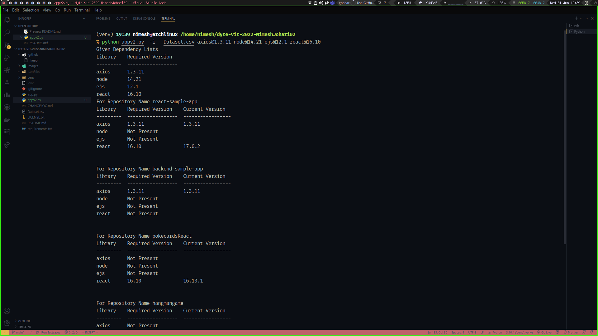
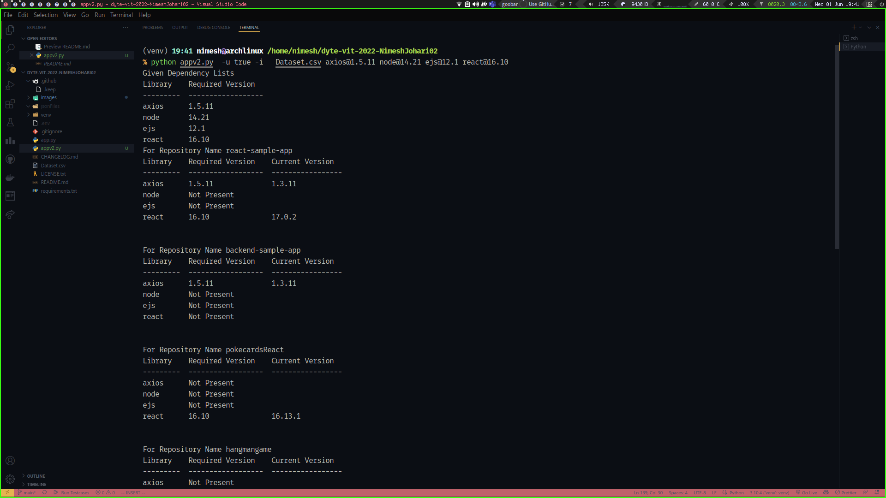

to run the code first make sure you get the required libraries installed.
 
 
<a href="https://www.python.org/downloads/">https://www.python.org/downloads/</a>
<!-- code block -->
<pre class="code-block "><code>pip install -r requirements.txt 

<!-- large text div -->
##

Since we are planning to run this as a microservice the lesser the storage space and the files it has to fetch it better .
it is for this reason that i have decided to use native libraries for the following:
 
 
<ul>
####<li> getting args from the cli </li>
####<li> parsing the args and storing them using lists</li>
####<li> not using libraries like pandas or numpy which increase the overall size of the dependencies thus making the entire service charge more . </li>
####<li>trying to fetch the </li>
####<li>Fetching only package.json from the given URL's </li>
####<li> Using github CLI (gh) to fetch the files from the given URL's</li>
 
#### To install gh use the following command:
### (For Mine and Arch Based Machines :) 
 
##<pre class="code-block "><code>sudo pacman -S github-cli

<!-- Usage -->

<h2>Usage</h2>
For Subtask 1 :
Fetching Dependency and its version from the given URL's Use the below Command 
<pre class="code-block "><code> python app.py -i Dataset.csv axios@0.24.0 

Output

<!-- image -->

<!-- Large Text -->

For information Fetching ie subtask 2
Use the Following command
<pre class="code-block "><code> python app.py -u true -i Dataset.csv axios@0.25.8 nodemon@2.1.1
</pre>
Output

<!-- image -->

 
 
 

##<h2>TODO</h2>
<ul>
###<li>Fix JSON Parsing Python Error</li>
###<li>Create Pull Request</li>
 
 
 
 
 
<!-- Made With Love -->
Made with <i class="fa fa-heart" aria-hidden="true"></i> by <a href="github.com/NimeshJohari02">Nimesh Johari</a>
