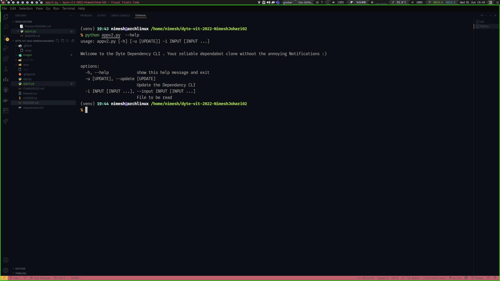
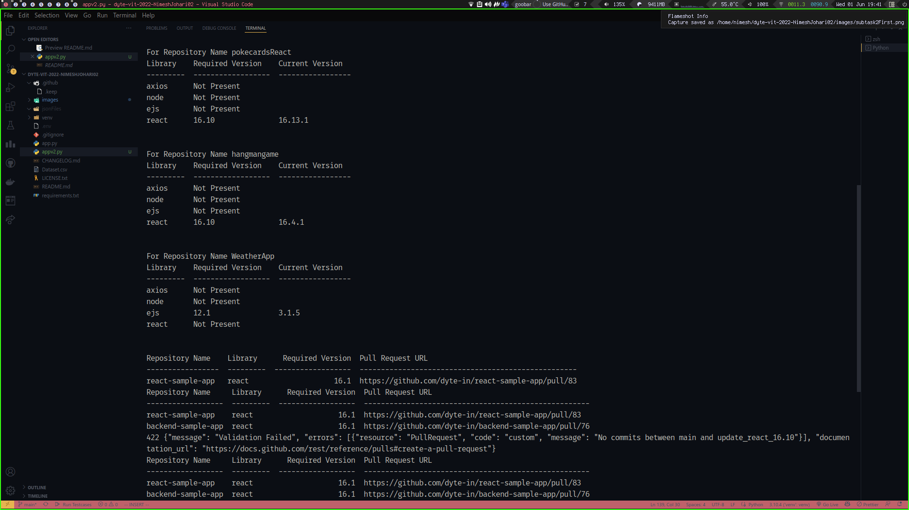

# Dyte ToolKit Submission 
##DependaTroll
Your friendly neighborhood Dependabot clone . Just without the annoying mails and notifications :)
Yeah also light weight :-).
To get started just type dependatroll --help 


# Environment Variables

To run this project, you will need to add the following environment variables to your .env file

`GITHUB_AUTH_TOKEN`

`GITHUB_USERNAME`

# First Version (app.py)
In the First Version of the script ie app.py We have shallow Cloned all the repositories from the CSV file . 
This is the first version of the script even though it is complete and working . It is not the most optimal way out there as it required extra bandwidth to clone all the repositories. And then use the bash/zsh shell of the host machine to run the script.
This was not only time and space intensive but also needed to have certain dependencies like git and github CLI to be installed on the host machine . Which is not the case for most of the people.
<!-- Create List -->
# WorkFlow For The First Version
<ul>
<li>Parse the CLI ARGS</li>
<li>Raw Content Fetched Using Curl </li>
<li>For Updates the Repositories Forked Using gh cli </li>
<li>Then the forked repositories were cloned to a depth == 1 and moved to the folder for JSON File</li>
<li>Then the corresponding Dependency changes were made and added to List </li>
<li>Table made using tabulate</li>
<li> This version had un-necessary dependencies and was not the most optimal way out there</li>
</ul>

# Second Version(appv2.py)

In the second version of the script ie appv2.py We have not cloned any of the repositories completely . Only fetched the package.json file . This method is much more efficient and less bandwidth intensive. As it does not pull the entire repository. As in some cases the repositories would be very large . Thus eliminating the network overhead of cloning the repository.Could save both time and money .

#### It is for the same reason of performance that I have not used libraries such as pandas for csv manipulation as the storage overhead might overway the cost . 
# Workflow for the Second Version
<ul>
<li>Parse the CLI ARGS</li>
<li>Json file fetched Using PyGithub GetContent allowing us to fetch only one file</li>
<li>Made changes in package.json</li>
<li>Tabulate the changes using tabulate</li>
<li>Forking the repository achieved by PyGithub</li>
<li>Creating a new Branch For every Dependancy Update</li>
<li>Creating Pull Request and Fetching URL for that Request to Append to the Table </li>

## Screenshots


### For the first subtask ie checking dependencies .


### For the subtask 2 ie Updating dependencies


### Final Table After Updations 


## Run Locally

Clone the project

```bash
  git clone https://github.com/dyte-submissions/dyte-vit-2022-NimeshJohari02
```

Go to the project directory

```bash
  cd dyte-vit-2022-NimeshJohari02/
```

Install dependencies

```bash
    pip install -r requirements.txt
```


# Usage/Examples

```python
# To check for unmet dependencies use the following command 

python appv2.py -i Dataset.csv axios@0.24.012 node@16.2 react@16.6 ejs@12.1

#Add any number of Libraries and Versions Seperated by " " and Versions by "@"

```


```python
# To check for updation of the unmet dependencies use the following command 

python appv2.py -u true -i Dataset.csv axios@0.24.012 node@16.2 react@16.6 ejs@12.1

#Add any number of Libraries and Versions Seperated by " " and Versions by "@"

```
## Output For subtask 2




## Updated dependencies look like these 


## Pull Request Once Created Can Also be seen from Github


<!-- CONTRIBUTING -->
## Contributing

Contributions are what make the open source community such an amazing place to learn, inspire, and create. Any contributions you make are **greatly appreciated**.

If you have a suggestion that would make this better, please fork the repo and create a pull request. You can also simply open an issue with the tag "enhancement".
Don't forget to give the project a star! Thanks again!

1. Fork the Project
2. Create your Feature Branch (`git checkout -b feature/AmazingFeature`)
3. Commit your Changes (`git commit -m 'Add some AmazingFeature'`)
4. Push to the Branch (`git push origin feature/AmazingFeature`)
5. Open a Pull Request

<p align="right">(<a href="#top">back to top</a>)</p>


<!-- CONTACT -->
## Contact

Nimesh Kumar Johari - [@github](https://github.com/NimeshJohari02) - nimeshjohari95@gmail.com

Project Link: [https://github.com/dyte-submissions/dyte-vit-2022-NimeshJohari02](https://github.com/github_username/repo_namehttps://github.com/dyte-submissions/dyte-vit-2022-NimeshJohari02)

<p align="right">(<a href="#top">back to top</a>)</p>


## Badges

[](https://github.com/tterb/atomic-design-ui/blob/master/LICENSEs)
[](https://opensource.org/licenses/)
[](http://www.gnu.org/licenses/agpl-3.0)

