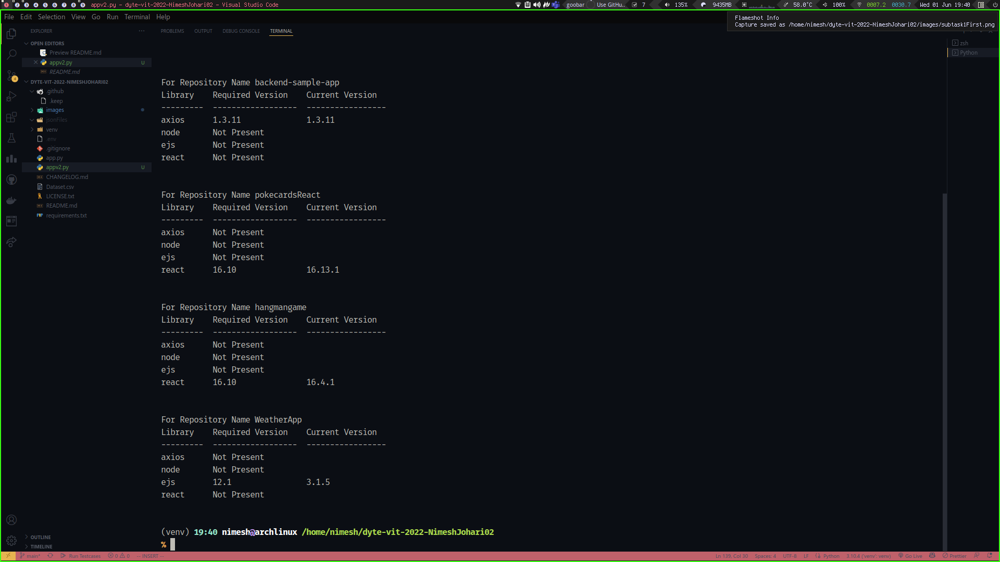
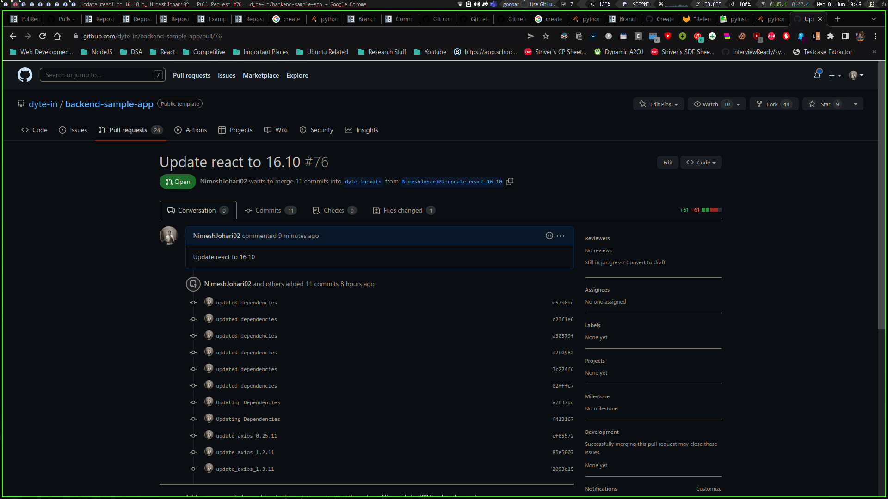

# Dyte ToolKit Submission 

Your friendly neighborhood Dependabot clone . Just without the annoying mails and notifications :)

## Environment Variables

To run this project, you will need to add the following environment variables to your .env file

`GITHUB_AUTH_TOKEN`

`GITHUB_USERNAME`


## Screenshots
For the first subtask ie checking dependencies . 


For the subtask 2 ie Updating dependencies


## Run Locally

Clone the project

```bash
  git clone https://github.com/dyte-submissions/dyte-vit-2022-NimeshJohari02
```

Go to the project directory

```bash
  cd dyte-vit-2022-NimeshJohari02/
```

Install dependencies

```bash
    pip install -r requirements.txt
```


# Usage/Examples

```python
# To check for unmet dependencies use the following command 

python app.py -i Dataset.csv axios@0.24.012 node@16.2 react@16.6 ejs@12.1

#Add any number of Libraries and Versions Seperated by " " and Versions by "@"

```





```python
# To check for updation of the unmet dependencies use the following command 

python app.py -u true -i Dataset.csv axios@0.24.012 node@16.2 react@16.6 ejs@12.1

#Add any number of Libraries and Versions Seperated by " " and Versions by "@"

```
## Output For subtask 1


## Updated dependencies look like these 


## Pull Request Once Created Can Also be seen from Github




## Badges

[](https://github.com/tterb/atomic-design-ui/blob/master/LICENSEs)
[](https://opensource.org/licenses/)
[](http://www.gnu.org/licenses/agpl-3.0)

